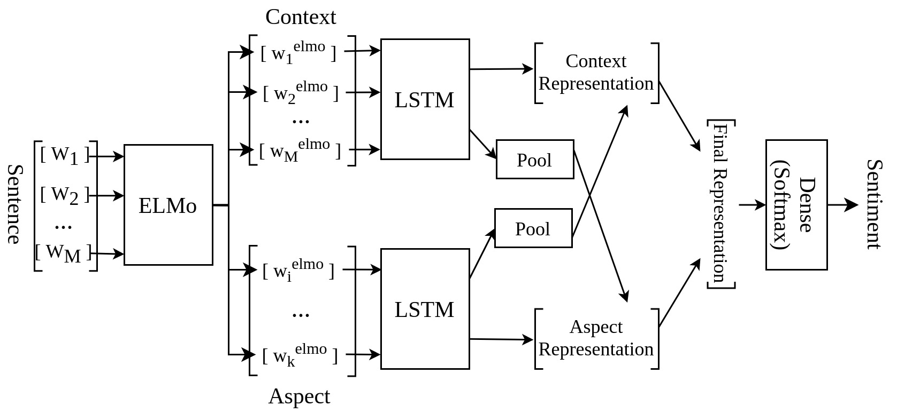

# CABSAR
**C**orpus for **A**spect-**B**ased **S**entiment **A**nalysis in **R**ussian-language sentences from different social sources.

This repository provides dataset and additional materials of the paper: ["Neural-network Method for Determining Text
Author’s Sentiment to an Aspect Specified by the
Named Entity"](http://ceur-ws.org/Vol-2648/paper11.pdf).

The dataset was prepared for the three sentiment label (positive, neutral, and negative) using a crowdsourcing platform and a home-grown procedure for collecting and controlling annotators markup.

Version 0.0.1 (paper version)

Data
---
The data is in Russian.

Data was collected from several sources: posts of the Live Journal social network, texts of the online news agency Lenta.ru, and Twitter microblog posts.

An example for an instance from the dataset is shown below:
```
{
	'context': {
		'text': 'даа уж, один Кирюха только и понимает ;-)',
		'sentences': [
			[
				{'forma': 'даа', 'lemma': 'да'},
			    {'forma': 'уж', 'lemma': 'уж'},
			    {'forma': ',', 'lemma': ','},
			    {'forma': 'один', 'lemma': 'один'},
			    {'forma': 'Кирюха', 'lemma': 'Кирюх'},
			    {'forma': 'только', 'lemma': 'только'},
			    {'forma': 'и', 'lemma': 'и'},
			    {'forma': 'понимает', 'lemma': 'понимать'},
			    {'forma': ';', 'lemma': ';'},
			    {'forma': '-', 'lemma': '-'},
			    {'forma': ')', 'lemma': ')'}
			]
		]
	},
	
	'aspect': {
		'text': 'Кирюха',
		'aspect_loc': [{'pos_start': 13, 'pos_end': 19}],
		'ner': 'PER'
	},
	
	'label': 1,
	'source': 'twitter'
}
```
Sentiment label codes: {0: 'neutral', 1: 'positive', 2: 'negative'}


In total, dataset contains 5,552 unique sentences (6,705 pairs aspect-sentiment) with 1,580 sentences from LiveJournal posts, 2,050 sentences from Lenta.Ru, and 1,992 sentences from Twitter.

The dataset includes a set of train/test splits, with 5,364, and 1,341 examples respectively.

The dataset are uploaded to our cloud storage and are available [here](https://cloud.mail.ru/public/CdJY/znRoHyBDA).

The number of labels by data source is presented in Table 1 and the number of unique named entities is presented in Table 2.

#### Table #1. The number of sentiment labels in different subsets of our dataset.

| Data source | Positive | Neutral | Negative |
| ----------- | -------- | ------- | -------- |
| Twitter     |    977   |   510   |    510   |
| Lenta.ru    |    478   |  1653   |    472   |
| LiveJournal |    834   |   905   |    366   |
| Total       |   2289   |  3068   |   1348   |

#### Table #2. The number of unique named entities in different subsets of our dataset.

| Data source | Person | Organisations | Total |
| ----------- | ------ | ------------- | ----- |
| Twitter     |  1432  |      275      |  1818 |
| Lenta.ru    |  1244  |      573      |  1817 |
| LiveJournal |  1307  |      285      |  1592 |
| Total       |  3761  |     1068      |  4829 |

Annotation procedure
---
Annotating sentences with labels of their emotions was performed with the help of a crowdsourcing platform [Yandex Toloka](https://yandex.ru/support/toloka/index.html?lang=en).

Only those of the 30% of the best-performing (by the platform’s internal rating) active Russian-speaking users over 18 years old were allowed into the annotation process. Before platform users became annotators, they underwent a training session in which they had to annotate 25 test cases (which we annotated ourselves), with more than 80% accuracy.

The annotators were asked to determine in what sentiment the author uses the named entity in the selected sentences (the classes of sentiment were “Positive”, “Neutral” and “Negative”). The sentence could not be marked with multiple tags. If the annotator could not unambiguously determine the sentiment class of the selected aspect, this example was marked with the label “I find it difficult to determine” and, in the absence of other annotations, was not included in the resulting dataset. If the selected aspect was incorrectly defined by a named entity, the example was marked as “Wrong aspect” and was also not included in the final dataset. 

Sentences were split into tasks and assigned to annotators so that each sentence was annotated at least three times.

The final label for a sentence was chosen based on the aggregate of annotator labels by majority vote.

Data Fields
---
Each instance is a text sentence in Russian with one aspect  sentiment label which includes the following fields:

Each instance is a text sentence in Russian with one specific named entity (aspect) and its corresponding sentiment label, which are included in the following fields:
- context:
	- text: the text of the sentence;
	- sentences: text tokenized and lemmatized with [udpipe](https://ufal.mff.cuni.cz/udpipe)
		- forma: the original word form;
  		- lemma: the lemma of this word
- aspect:
	- ner: tag name of the named entity of the aspect;
	- aspect_loc: 
		- pos_start: the position of the start symbol in the text of the sentence for the aspect
		- pos_end: the position of the ending character in the text of the sentence for the given aspect
- label: the sentiment label for aspect;
- source: the tag name of the corresponding source

Baselines
---
We compare several basic solutions:
1. Random: Random selection of a label for each aspect;
2. Lexicon: Classifier based on dictionaries of [positive and negative vocabulary](https://www.labinform.ru/pub/rusentilex/index.htm). The aspect is assigned sentiment label that belongs to the vocabulary with the largest number of words from which are present in the sentence.  If the number of words included in the dictionaries of different sentiment is the same, then the label of the most representative sentiment of the corpus is given, i.e. "positive" in this case. 
If the sentence does not contain any words from the dictionaries then the aspect is considered neutral.
3. TPOT (ELMo): The average vectors of aspect words of the analyzed sentence obtained from the [ELMo model](docs.deeppavlov.ai/en/master/features/pretrainedvectors.html#elmo) are used as input features for the classification model. The type of classifier and its parameters were selected automatically by the [TPOT library](http://epistasislab.github.io/tpot/);

Calculation of baselines is presented in the jupyter notebook ```./notebooks/Baseline_accuracy.ipynb``` Before running the notebook, you need to download the data and place them in a folder ```./data/```.

Our approach
---
The proposed method is based on deep neural network with attention ([IAN](https://arxiv.org/abs/1709.00893)), which solves a classification task. 

In our model, the context is all the words of the sentence which contains a named entity, and the aspect is the words that belong to the same named entity for which sentiment is determined. The sentence words are vectorized using the bi-directional language model ELMo. 

The figure below shows the scheme of the proposed model.



The performance of the baseline models on our dataset in terms of F1 scores is presented in Table 2.

#### Table #2. Performance of baseline models.

<table><thead><tr><th>Model</th><th colspan="2">Twitter<br></th><th colspan="2">LJ</th><th colspan="2">Lenta .ru</th><th colspan="2">All</th></tr></thead><tbody><tr><td></td><td>mic.</td><td>mac.</td><td>mic.</td><td>mac.</td><td>mic.</td><td>mac.</td><td>mic.</td><td>mac.</td></tr><tr><td>Random</td><td>0.34</td><td>0.33</td><td>0.34</td><td>0.33</td><td>0.34</td><td>0.32</td><td>0.31</td><td>0.30</td></tr><tr><td>Lexicon</td><td>0.48</td><td>0.36</td><td>0.42</td><td>0.34</td><td>0.35</td><td>0.34</td><td>0.41</td><td>0.35</td></tr><tr><td>TPOT (ELMo)</td><td>0.63</td><td>0.57</td><td>0.59</td><td>0.57</td><td>0.74</td><td>0.71</td><td>0.66</td><td>0.65</td></tr><tr><td>Our approach</td><td>0.64</td><td>0.58</td><td>0.67</td><td>0.66</td><td>0.78</td><td>0.72</td><td>0.72</td><td>0.70</td></tr></tbody></table>

Note
---
In the published article, incorrect accuracies were reported in Table 2 for the baseline models "Random" and "Lexicon", but the overall result and conclusions were not affected, the correct accuracies are reported in Table 2 of this repository.

Requirements
---
- Python 3.7+
- scikit-learn==0.22.1
- tpot==0.11.1

Citing & Authors
---
If you have found our results helpful in your work, feel free to cite our publication and this repository as

```
@article{naumov2020neural,
  title={Neural-network Method for Determining Text Author’s Sentiment to an Aspect Specified by the Named Entity},
  author={Naumov, Aleksandr and Sboev, Alexander and Rybka, Roman and Selivanov, Anton and Gryaznov, Artem},
  year={2020}
}
```

Contributions
---
Thanks to [@naumov-al](https://github.com/naumov-al) for adding this dataset.
